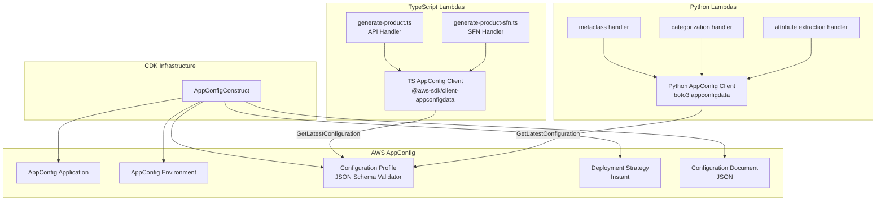

# Design Document: AppConfig Runtime Configuration

## Overview

This design introduces AWS AppConfig as the runtime configuration source for AI model settings across all Smart Product Onboarding components. Currently, model IDs are hardcoded as environment variables in CDK constructs (`sfn-generate-product-task`, `sfn-metaclass-task`, `sfn-classification-task`, `sfn-attributes-task`, and the API construct), and temperature values are either hardcoded in application code or not configurable at all.

The solution adds:
1. A CDK construct that provisions AppConfig resources (application, environment, configuration profile, deployment strategy) with JSON Schema validation.
2. A TypeScript configuration client in `packages/api/handlers/typescript/src/` that fetches and caches configuration from AppConfig using the `@aws-sdk/client-appconfigdata` SDK.
3. A Python configuration client in `packages/smart-product-onboarding/core-utils/` that fetches and caches configuration using `boto3`'s `appconfigdata` client.
4. Integration points in each Lambda handler to read `modelId` and `temperature` from the configuration client, falling back to environment variables on failure.

All four components share a single AppConfig configuration profile containing one JSON document with four top-level keys.

## Architecture



### Key Design Decisions

1. **Single configuration profile**: All four component configs live in one JSON document under one AppConfig configuration profile. This keeps the infrastructure simple and allows atomic updates across components.

2. **AppConfig Data client (not Lambda extension)**: We use the `AppConfigData` SDK client (`StartConfigurationSession` + `GetLatestConfiguration`) directly rather than the AppConfig Lambda Layer extension. This avoids adding a Lambda layer dependency and gives us explicit control over caching and error handling. The SDK client's built-in token-based polling mechanism handles caching — each `GetLatestConfiguration` call returns a new poll token and the service returns an empty body if the configuration hasn't changed.

3. **Module-level singleton clients**: Both the TypeScript and Python configuration clients are instantiated at module level (outside the handler function) so they persist across warm Lambda invocations. The polling token is reused across invocations, and AppConfig only returns new configuration data when it has changed.

4. **Fallback to environment variables**: If AppConfig is unreachable, each handler falls back to the existing `BEDROCK_MODEL_ID` environment variable and hardcoded default temperatures. This ensures zero downtime during AppConfig outages.

5. **Instant deployment strategy**: The deployment strategy uses 0-minute bake time and 100% growth factor for immediate configuration updates. Operators who want gradual rollout can modify the strategy later.

## Components and Interfaces

### 1. CDK Construct: `AppConfigConstruct`

**Location**: `packages/infra/src/constructs/appconfig/appconfig.ts`

```typescript
interface AppConfigConstructProps {
  applicationName: string;
  environmentName: string;
}

// Exposes:
// - applicationId: string
// - environmentId: string  
// - configurationProfileId: string
// - grantRead(grantee: iam.IGrantable): void
```

This construct creates:
- `CfnApplication` — the AppConfig application
- `CfnEnvironment` — the deployment environment
- `CfnConfigurationProfile` — with a JSON Schema validator
- `CfnDeploymentStrategy` — instant deployment (growth 100%, bake 0 min, deploy 0 min)

No initial configuration document is deployed. Operators deploy configuration via the AppConfig console or API when ready. Until then, all Lambda handlers fall back to their environment variable defaults.

The `grantRead` method adds an IAM policy allowing `appconfig:StartConfigurationSession` and `appconfig:GetLatestConfiguration` on the configuration profile resource.

### 2. TypeScript Configuration Client

**Location**: `packages/api/handlers/typescript/src/services/appConfigClient.ts`

```typescript
interface AppConfigSettings {
  modelId: string;
  temperature: number;
}

class AppConfigClient {
  constructor(
    applicationId: string,
    environmentId: string,
    configurationProfileId: string,
  );

  async getConfiguration(componentKey: string): Promise<AppConfigSettings | null>;
}
```

- Uses `@aws-sdk/client-appconfigdata` (`StartConfigurationSession`, `GetLatestConfiguration`)
- Maintains a session token that is reused across invocations
- Parses the JSON response and returns the settings for the requested component key
- Returns `null` on any error (network, parse, missing key) or when the response body is empty (no configuration deployed yet), allowing callers to fall back

### 3. Python Configuration Client

**Location**: `packages/smart-product-onboarding/core-utils/amzn_smart_product_onboarding_core_utils/appconfig_client.py`

```python
@dataclass
class AppConfigSettings:
    model_id: str
    temperature: float

class AppConfigClient:
    def __init__(
        self,
        application_id: str,
        environment_id: str,
        configuration_profile_id: str,
    ): ...

    def get_configuration(self, component_key: str) -> AppConfigSettings | None: ...
```

- Uses `boto3.client("appconfigdata")` (`start_configuration_session`, `get_latest_configuration`)
- Same token-based polling pattern as the TypeScript client
- Returns `None` on failure or when the response body is empty (no configuration deployed yet) so handlers can fall back

### 4. Handler Integration Points

**TypeScript handlers** (`generate-product-sfn.ts`, `generate-product.ts`):
- Instantiate `AppConfigClient` at module level using env vars `APPCONFIG_APPLICATION_ID`, `APPCONFIG_ENVIRONMENT_ID`, `APPCONFIG_CONFIGURATION_PROFILE_ID`
- In the handler, call `getConfiguration("productGeneration")`
- If successful, use returned `modelId` and `temperature`; otherwise fall back to `BEDROCK_MODEL_ID` env var and default temperature `0.1`
- For `generate-product-sfn.ts`: AppConfig values override the SSM parameter's `model` and `temperature` fields but SSM still provides `language`, `descriptionLength`, and `examples`

**Python handlers** (`aws_lambda.py` for metaclasses, `categorization.py`, `attribute_extraction.py`):
- Instantiate `AppConfigClient` at module level using env vars
- In the handler, call `get_configuration("<component_key>")` with the appropriate key
- If successful, use returned `model_id` and `temperature`; otherwise fall back to `BEDROCK_MODEL_ID` env var and existing default temperature

**Temperature integration for components that currently lack it**:
- `metaclass_classifier.py`: The `get_model_response` helper in `bedrock_runtime_client.py` currently hardcodes `temperature: 0`. The metaclass handler will pass the temperature from config to `get_model_response` via a new optional `temperature` parameter.
- `product_classifier/__init__.py`: The `_get_model_response` method hardcodes `temperature: 0` in `inferenceConfig`. It will accept temperature as a constructor parameter.
- `attributes_extractor/__init__.py`: The `extract_attributes` method hardcodes `temperature: 0` in `inferenceConfig`. It will accept temperature as a constructor parameter.

## Data Models

### Configuration Document Schema

```json
{
  "$schema": "http://json-schema.org/draft-07/schema#",
  "type": "object",
  "required": ["productGeneration", "metaclassClassification", "productCategorization", "attributeExtraction"],
  "additionalProperties": false,
  "properties": {
    "productGeneration": { "$ref": "#/$defs/componentConfig" },
    "metaclassClassification": { "$ref": "#/$defs/componentConfig" },
    "productCategorization": { "$ref": "#/$defs/componentConfig" },
    "attributeExtraction": { "$ref": "#/$defs/componentConfig" }
  },
  "$defs": {
    "componentConfig": {
      "type": "object",
      "required": ["modelId", "temperature"],
      "additionalProperties": false,
      "properties": {
        "modelId": { "type": "string", "minLength": 1 },
        "temperature": { "type": "number", "minimum": 0, "maximum": 1 }
      }
    }
  }
}
```

### Default Configuration Document

```json
{
  "productGeneration": {
    "modelId": "us.amazon.nova-lite-v1:0",
    "temperature": 0.1
  },
  "metaclassClassification": {
    "modelId": "us.amazon.nova-micro-v1:0",
    "temperature": 0
  },
  "productCategorization": {
    "modelId": "us.anthropic.claude-3-haiku-20240307-v1:0",
    "temperature": 0
  },
  "attributeExtraction": {
    "modelId": "us.amazon.nova-premier-v1:0",
    "temperature": 0
  }
}
```

### Environment Variables Added to Each Lambda

| Variable | Value |
|---|---|
| `APPCONFIG_APPLICATION_ID` | AppConfig application ID |
| `APPCONFIG_ENVIRONMENT_ID` | AppConfig environment ID |
| `APPCONFIG_CONFIGURATION_PROFILE_ID` | AppConfig configuration profile ID |

These are passed from the CDK construct to each Lambda function's environment.


## Correctness Properties

*A property is a characteristic or behavior that should hold true across all valid executions of a system — essentially, a formal statement about what the system should do. Properties serve as the bridge between human-readable specifications and machine-verifiable correctness guarantees.*

### Property 1: Configuration document structure validity

*For any* JSON object that passes the configuration JSON Schema, it must contain exactly the four keys `productGeneration`, `metaclassClassification`, `productCategorization`, and `attributeExtraction`, and each value must contain a `modelId` string (non-empty) and a `temperature` number in [0, 1].

**Validates: Requirements 2.1, 2.2, 2.3**

### Property 2: JSON Schema rejects invalid configuration documents

*For any* JSON object that is missing a required top-level key, has an invalid `modelId` (empty string or non-string), has an invalid `temperature` (outside [0, 1] or non-number), or contains additional properties, the JSON Schema validator must reject it.

**Validates: Requirements 2.5**

### Property 3: Handlers use AppConfig values when available

*For any* valid configuration returned by the AppConfig client, the handler must use the `modelId` and `temperature` from that configuration (for the appropriate component key) when calling the Bedrock API, rather than the environment variable defaults.

**Validates: Requirements 3.3, 4.5**

### Property 4: Handlers fall back to defaults on AppConfig failure

*For any* failure of the AppConfig client (network error, parse error, missing key), the handler must use the `BEDROCK_MODEL_ID` environment variable as the model ID and the hardcoded default temperature value.

**Validates: Requirements 3.4, 4.6**

### Property 5: Temperature from configuration is passed to Bedrock API calls

*For any* temperature value in [0, 1] provided by the configuration, each component (metaclass classification, product categorization, attribute extraction) must pass that exact temperature value in the `inferenceConfig` of the Bedrock `converse` call.

**Validates: Requirements 5.1, 5.2, 5.3**

### Property 6: AppConfig values take precedence over SSM for model and temperature

*For any* combination where both AppConfig provides a `modelId`/`temperature` and the SSM Parameter Store config also contains `model`/`temperature` fields, the Product Generation component must use the AppConfig values for model ID and temperature while still using SSM values for `language`, `descriptionLength`, and `examples`.

**Validates: Requirements 6.2**

## Error Handling

| Scenario | Behavior |
|---|---|
| No configuration deployed yet (empty response body) | Log info, return `null`/`None`. Handler uses env var fallback. This is the expected state on initial deployment before a configuration version is deployed. |
| AppConfig `StartConfigurationSession` fails | Log warning, return `null`/`None`. Handler uses env var fallback. |
| AppConfig `GetLatestConfiguration` fails | Log warning, return last cached config if available, otherwise `null`/`None`. Handler uses env var fallback. |
| Configuration JSON parse error | Log warning, return `null`/`None`. Handler uses env var fallback. |
| Missing component key in configuration | Log warning, return `null`/`None`. Handler uses env var fallback. |
| `temperature` out of range after schema validation bypass | The Bedrock API will reject it. Existing error handling in each handler catches Bedrock client errors. |
| AppConfig service outage | All handlers continue operating with env var defaults. No user-facing impact. |

The configuration clients must never throw exceptions that propagate to the handler's caller. All errors are caught internally and result in a `null`/`None` return, triggering the fallback path.

## Testing Strategy

### Unit Tests

- **CDK construct tests**: Use CDK assertions (`Template.fromStack`) to verify that the synthesized CloudFormation template contains the expected AppConfig resources (application, environment, configuration profile, deployment strategy) with correct properties. Verify IAM policies grant `appconfig:StartConfigurationSession` and `appconfig:GetLatestConfiguration`.
- **TypeScript AppConfig client**: Mock `@aws-sdk/client-appconfigdata` to test successful config retrieval, caching behavior (session token reuse), error handling (network failures, malformed JSON), and `null` return on failure.
- **Python AppConfig client**: Mock `boto3` `appconfigdata` client to test the same scenarios.
- **Handler integration**: Test that handlers correctly use AppConfig values when available and fall back to env vars when the client returns `null`/`None`. Test that the SSM config for `generate-product-sfn.ts` still provides `language`, `descriptionLength`, and `examples` while AppConfig overrides `model` and `temperature`.
- **Temperature passthrough**: Verify that `MetaclassClassifier`, `ProductClassifier`, and `AttributesExtractor` pass the configured temperature to Bedrock calls.
- **Default configuration document**: Verify the initial config document matches expected default values.

### Property-Based Tests

Property-based tests use generated inputs to verify universal properties. Each test runs a minimum of 100 iterations.

- **Library**: TypeScript tests use `fast-check`; Python tests use `hypothesis`.
- **Configuration**: Minimum 100 examples per property test.
- **Tagging**: Each test is tagged with a comment referencing the design property:
  - Format: `Feature: appconfig-runtime-configuration, Property {number}: {property_text}`

Property tests to implement:

1. **Property 1** — Generate random valid configuration documents and verify they pass the JSON Schema. Generate documents with all four keys, valid modelId strings, and temperatures in [0, 1].
2. **Property 2** — Generate random invalid configuration documents (missing keys, wrong types, out-of-range temperatures, extra properties) and verify the JSON Schema rejects them.
3. **Property 3** — Generate random valid AppConfig responses and verify the handler extracts and uses the correct `modelId` and `temperature` for the requested component key.
4. **Property 4** — Generate random error conditions for the AppConfig client and verify the handler falls back to the environment variable model ID and default temperature.
5. **Property 5** — Generate random temperature values in [0, 1] and verify each Python component passes the exact value to the Bedrock `inferenceConfig`.
6. **Property 6** — Generate random combinations of AppConfig config and SSM config, and verify the Product Generation handler uses AppConfig's `modelId`/`temperature` while preserving SSM's `language`, `descriptionLength`, and `examples`.
