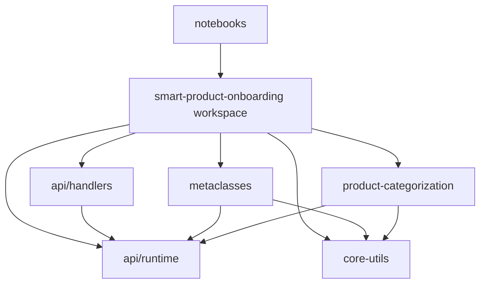

# Design Document

## Overview

This design outlines the migration from pyenv/poetry to uv for Python dependency management in the Smart Product Onboarding project. The migration involves restructuring Python packages into a uv workspace, eliminating file copying operations, and updating build processes to use uv commands throughout.

## Architecture

### Current State

```
packages/
├── api/
│   ├── generated/runtime/python/          # Generated API runtime (poetry)
│   └── handlers/python/                   # API handlers (poetry)
├── smart-product-onboarding/
│   ├── api/                              # Copied API runtime (poetry)
│   ├── core-utils/                       # Core utilities (poetry)
│   ├── metaclasses/                      # Metaclasses package (poetry)
│   └── product-categorization/           # Product categorization (poetry)
└── notebooks/                            # Configuration notebooks (poetry)
```

### Target State

```
packages/
├── api/
│   └── model/                            # OpenAPI specifications only
├── smart-product-onboarding/             # UV WORKSPACE ROOT
│   ├── pyproject.toml                    # Workspace configuration
│   ├── uv.lock                          # Workspace lockfile
│   ├── api/
│   │   ├── runtime/                      # Generated API runtime (uv member)
│   │   └── handlers/                     # API handlers (uv member)
│   ├── core-utils/                       # Core utilities (uv member)
│   ├── metaclasses/                      # Metaclasses package (uv member)
│   └── product-categorization/           # Product categorization (uv member)
└── notebooks/                            # Standalone uv package
    ├── pyproject.toml                    # References workspace packages
    └── uv.lock                          # Separate lockfile
```

## Components and Interfaces

### UV Workspace Configuration

**Root Workspace (packages/smart-product-onboarding/pyproject.toml)**

```toml
[tool.uv.workspace]
members = [
    "api/runtime",
    "api/handlers",
    "core-utils",
    "metaclasses",
    "product-categorization"
]

[tool.uv.sources]
# Workspace package sources
amzn-smart-product-onboarding-core-utils = { workspace = true }
amzn-smart-product-onboarding-api-runtime = { workspace = true }

[dependency-groups]
dev = [
    "ruff>=0.8.2",
    "pytest>=8.3.5",
    "boto3-stubs-lite[bedrock-runtime,dynamodb,s3,ssm,stepfunctions]>=1.37.31",
]
```

### Package Structure

**API Runtime (packages/smart-product-onboarding/api/runtime/pyproject.toml)**

```toml
[project]
name = "amzn-smart-product-onboarding-api-runtime"
version = "0.1.0"
requires-python = ">=3.12,<4"
dependencies = [
    "aenum>=3.1.11",
    "pydantic>=2.5.2",
    "python-dateutil~=2.8.2",
    "urllib3~=1.26.7",
    "aws-lambda-powertools[tracer,aws-sdk]>=2.28.0",
]

[tool.hatch.build.targets.wheel]
packages = ["amzn_smart_product_onboarding_api_runtime"]
```

**API Handlers (packages/smart-product-onboarding/api/handlers/pyproject.toml)**

```toml
[project]
name = "amzn-smart-product-onboarding-api-handlers"
version = "0.1.0"
requires-python = ">=3.12,<4"
dependencies = [
    "amzn-smart-product-onboarding-api-runtime",
]

[dependency-groups]
dev = [
    "pytest>=8.3.5",
    "boto3-stubs-lite[dynamodb,s3,stepfunctions]>=1.37.31",
    "moto[all]>=5.0.16",
]
```

**Core Utils (packages/smart-product-onboarding/core-utils/pyproject.toml)**

```toml
[project]
name = "amzn-smart-product-onboarding-core-utils"
version = "0.1.0"
requires-python = ">=3.12,<4"
dependencies = [
    "boto3>=1.35.37",
    "lxml>=5.3.0",
    "pydantic>=2.9.2",
    "tenacity>=9.0.0",
]

[dependency-groups]
dev = [
    "pytest>=8.3.5",
    "mypy>=1.11.2",
    "boto3-stubs-lite[bedrock-runtime,dynamodb,firehose,s3,sagemaker-a2i-runtime,ssm,stepfunctions]>=1.35.37",
    "moto[all]>=5.0.16",
]
```

### Code Generation Integration

**API Generation Target Update**

- Generator output path changes from `packages/api/generated/runtime/python` to `packages/smart-product-onboarding/api/runtime`
- Eliminates rsync/copy operations in package target
- Direct generation into workspace member location

**Nx Target Configuration**

```json
{
  "generate": {
    "executor": "nx:run-commands",
    "options": {
      "command": "npx --yes -p @aws/pdk@$AWS_PDK_VERSION type-safe-api generate --specPath ../../../model/.api.json --outputPath ../../../../smart-product-onboarding/api/runtime --templateDirs \"python\" --metadata '{\"srcDir\":\"amzn_smart_product_onboarding_api_runtime\",\"moduleName\":\"amzn_smart_product_onboarding_api_runtime\",\"projectName\":\"amzn-smart-product-onboarding-api-runtime\"}'",
      "cwd": "packages/api/generated/runtime/python",
      "env": {
        "AWS_PDK_VERSION": "0.26.7"
      }
    }
  }
}
```

## Data Models

### Dependency Relationships



### Package Dependencies

**Workspace Internal Dependencies:**

- `api/handlers` → `api/runtime`
- `metaclasses` → `core-utils`, `api/runtime`
- `product-categorization` → `core-utils`, `api/runtime`

**External Dependencies:**

- `notebooks` → workspace packages (as external references)
- All packages → AWS SDK, ML libraries, testing frameworks

## Error Handling

### Migration Validation

1. **Dependency Resolution Validation**
   - Verify all workspace dependencies resolve correctly
   - Check for circular dependencies
   - Validate external dependency compatibility

2. **Build Process Validation**
   - Ensure all Nx targets execute successfully with uv commands
   - Verify Lambda packaging works with uv export
   - Test Docker builds with uv installation

3. **Import Path Validation**
   - Verify all Python imports work after restructuring
   - Test notebook imports of workspace packages
   - Validate API handler imports of runtime packages

### Rollback Strategy

1. **Preserve Original Structure**
   - Keep poetry.lock files as backup during migration
   - Maintain git history for easy rollback
   - Document original Nx target configurations

2. **Incremental Migration**
   - Migrate packages one at a time
   - Test each package independently
   - Validate workspace integration at each step

## Testing Strategy

### Unit Testing

1. **Package-Level Testing**
   - Each workspace member maintains its own test suite
   - Use `uv run pytest` for test execution
   - Maintain test coverage requirements

2. **Workspace Integration Testing**
   - Test cross-package imports and dependencies
   - Verify workspace dependency resolution
   - Test notebook integration with workspace packages

### Build Testing

1. **Nx Target Testing**
   - Verify all updated Nx targets execute successfully
   - Test build, test, lint, and package targets
   - Validate Lambda packaging with uv export

2. **Docker Build Testing**
   - Test container builds with uv installation
   - Verify Lambda packaging in containerized environment
   - Test multi-stage builds with workspace packages

### Integration Testing

1. **End-to-End Workflow Testing**
   - Test complete development workflow with uv
   - Verify API generation and workspace integration
   - Test notebook execution with workspace dependencies

2. **Deployment Testing**
   - Test Lambda function deployment with uv-packaged dependencies
   - Verify container deployment with uv-managed packages
   - Test infrastructure deployment with updated build processes

## Implementation Phases

### Phase 1: Workspace Setup

- Create workspace root pyproject.toml
- Configure workspace members
- Set up shared development dependencies

### Phase 2: Package Migration

- Convert individual packages to uv format
- Update dependency references to use workspace sources
- Migrate from poetry to uv commands

### Phase 3: Build System Integration

- Update Nx targets to use uv commands
- Modify API generation to output directly to workspace
- Update Docker builds to use uv

### Phase 4: Validation and Cleanup

- Test all workflows end-to-end
- Remove old poetry configurations
- Update documentation and development guides
