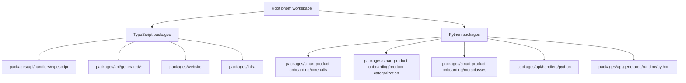
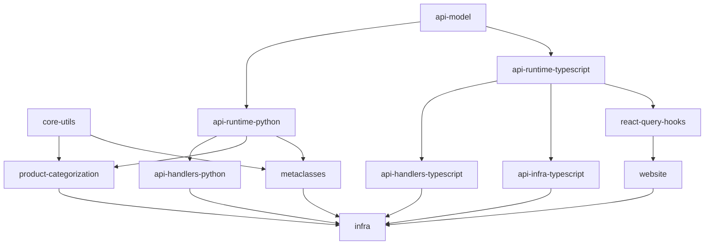

# Design Document

## Overview

This design outlines the migration strategy for ejecting the Smart Product Onboarding project from Projen/PDK management to direct pnpm + Nx management. The migration will preserve all existing functionality while removing the Projen abstraction layer and converting all tasks to native Nx targets.

The project currently consists of:

- 6 TypeScript packages (API infrastructure, handlers, runtime, libraries, website, infra)
- 5 Python packages (core-utils, product-categorization, metaclasses, API handlers, API runtime)
- Complex build dependencies between packages
- CDK infrastructure with deployment targets
- Generated code from TypeSafe API specifications

## Architecture

### Migration Strategy

The migration follows a phased approach:

1. **Preparation Phase**: Analyze current Projen tasks and dependencies
2. **Ejection Phase**: Run `projen eject` to generate scripts
3. **Conversion Phase**: Convert generated scripts to Nx targets
4. **Cleanup Phase**: Remove Projen artifacts and generated scripts
5. **Validation Phase**: Ensure all functionality works identically

### Package Management Architecture

### Build Dependency Graph

## Components and Interfaces

### Root Workspace Configuration

**pnpm-workspace.yaml**

- Defines all TypeScript packages in workspaces
- Python packages managed separately via Poetry

**nx.json**

- Enhanced target defaults for build orchestration
- Proper caching configuration for all package types
- Task runner configuration optimized for mixed TypeScript/Python monorepo

**package.json**

- Root scripts converted from Projen tasks to direct Nx commands
- Dependency management for shared TypeScript tooling
- Postinstall hook for Python package installation

### TypeScript Package Configuration

Each TypeScript package will have:

**package.json**

- Direct scripts without Projen wrappers
- Proper dependency declarations
- Build and test configurations

**project.json** (where needed)

- Nx targets for complex build processes
- Dependency declarations between packages
- Custom executors for specialized tasks

### Python Package Configuration

Each Python package will have:

**pyproject.toml**

- Standard Poetry configuration without Projen generation
- Direct dependency management
- Build system configuration

**Nx Integration**

- Nx targets in root project.json for Python package management
- Poetry commands wrapped in Nx executors
- Proper dependency tracking between Python and TypeScript packages

### CDK Infrastructure Package

**Enhanced Nx Targets**

- `synth`: CDK synthesis with dependencies on Lambda builds
- `deploy`: CDK deployment with proper dependency chain
- `destroy`: CDK stack destruction
- `diff`: CDK diff generation
- `watch`: Development mode with hot reloading

## Data Models

### Task Conversion Mapping

| Projen Task | Nx Target | Executor          | Dependencies |
| ----------- | --------- | ----------------- | ------------ |
| `build`     | `build`   | `nx:run-commands` | `^build`     |
| `compile`   | `compile` | `nx:run-commands` | `^compile`   |
| `test`      | `test`    | `nx:run-commands` | `compile`    |
| `package`   | `package` | `nx:run-commands` | `build`      |
| `eslint`    | `lint`    | `@nx/eslint:lint` | -            |
| `synth`     | `synth`   | `nx:run-commands` | `^build`     |
| `deploy`    | `deploy`  | `nx:run-commands` | `synth`      |

### Python Package Integration

| Poetry Command      | Nx Target | Command             |
| ------------------- | --------- | ------------------- |
| `poetry install`    | `install` | `poetry install`    |
| `poetry build`      | `build`   | `poetry build`      |
| `poetry run pytest` | `test`    | `poetry run pytest` |

### Dependency Resolution

**TypeScript Dependencies**

- Managed through pnpm workspaces
- Version synchronization via syncpack
- Nx dependency graph for build ordering

**Python Dependencies**

- Managed through Poetry in each package
- Local path dependencies for internal packages
- Nx orchestration for cross-language dependencies

## Error Handling

### Migration Validation

1. **Build Verification**: All packages must build successfully
2. **Test Verification**: All tests must pass
3. **Deployment Verification**: CDK synthesis and deployment must work
4. **Dependency Verification**: All package dependencies must resolve correctly

### Rollback Strategy

1. **Git Checkpoint**: Create branch before migration
2. **Projen Restoration**: Keep .projenrc.ts for potential rollback
3. **Incremental Migration**: Migrate packages one at a time
4. **Validation Gates**: Verify each package before proceeding

### Common Issues and Solutions

**Issue**: Generated code conflicts
**Solution**: Preserve generated/ directories, only modify configuration

**Issue**: Python package installation failures
**Solution**: Ensure Poetry lockfiles are preserved and updated correctly

**Issue**: CDK deployment failures
**Solution**: Verify all Lambda build artifacts are properly generated

## Testing Strategy

### Unit Testing

1. **Package-level Tests**: Each package's tests must continue to pass
2. **Integration Tests**: Cross-package integration tests must work
3. **Build Tests**: Verify all build artifacts are generated correctly

### Integration Testing

1. **Full Build**: Complete monorepo build from clean state
2. **CDK Synthesis**: Verify CDK can synthesize all stacks
3. **Deployment Test**: Deploy to test environment
4. **API Tests**: Verify all API endpoints work correctly

### Performance Testing

1. **Build Performance**: Compare build times before/after migration
2. **Cache Effectiveness**: Verify Nx caching works for all targets
3. **Parallel Execution**: Ensure proper parallelization of builds

### Validation Checklist

- [ ] All TypeScript packages build successfully
- [ ] All Python packages build successfully
- [ ] All tests pass
- [ ] CDK synthesis works
- [ ] CDK deployment works
- [ ] Website builds and runs
- [ ] API handlers function correctly
- [ ] No Projen artifacts remain
- [ ] All scripts/ folders removed
- [ ] Build performance maintained or improved
