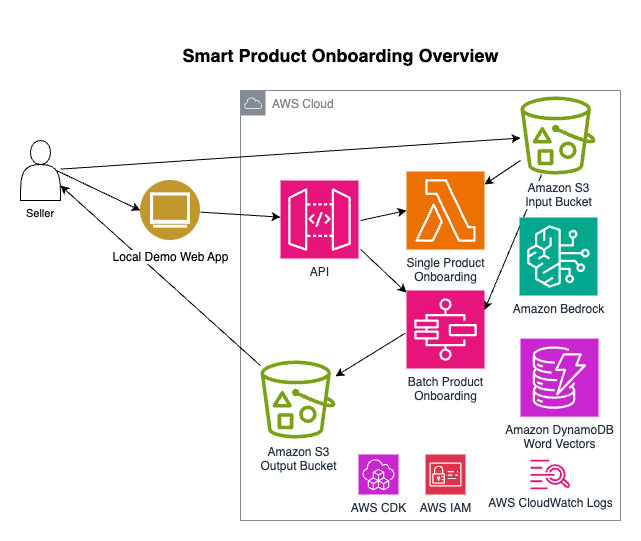

# Smart Product Onboarding

The Smart Product Onboarding accelerator demonstrates an innovative approach to enhancing the product onboarding process for e-commerce platforms. It showcases Bottom-Up Product Categorization, Generative AI-powered product data generation, and intelligent attribute extraction to improve catalog management and product listings. Using generative AI, the accelerator illustrates how to categorize products within complex category trees, generate product titles and descriptions from images and metadata, and extract attributes based on category-specific schemas. This adaptive approach handles changes to the category tree without model retraining and allows for improvement through manual auditing of results. Built on Amazon Bedrock, AWS Step Functions, and AWS Lambda, the accelerator provides a starting point for retailers to explore efficient management of large product catalogs, adaptation to market needs, and delivery of enhanced product information. Customers are encouraged to build upon and customize this accelerator to meet their specific requirements and production needs.

## Example


## Architecture


[Detailed diagrams](architecture.md#architecture)

## Technical Approach

The Smart Product Onboarding accelerator comprises three main components, each leveraging advanced AI capabilities to streamline different aspects of the product onboarding process:

### Generate Product Data from Images

The [Product Data Generation component](documentation/generate-product-data-from-images.md#generate-product-data-from-images) automatically creates high-quality product titles and descriptions from images. Utilizing Amazon Bedrock with the Anthropic Claude 3 Haiku model, it analyzes product images and optional metadata to produce engaging and informative product listings. The solution's flexibility allows for customization to suit various e-commerce platforms and product categories, while its serverless architecture ensures scalability and cost-effectiveness for retailers of all sizes.

### Bottom-Up Product Categorization

At the heart of the accelerator, the [Bottom-Up Product Categorization component](documentation/bottom-up-product-categorization/index.md#bottom-up-product-categorization) automatically assigns products to the most appropriate category in large, hierarchical category trees. It employs a two-step process: first identifying key concepts (metaclasses) from product titles, then using a large language model to make nuanced categorization decisions. This approach significantly reduces manual effort, improves catalog consistency, and enhances the overall shopping experience. The system's adaptability to different languages and category structures makes it versatile for global e-commerce businesses.

### Extract Attributes

Building upon the categorization process, the [Attribute Extraction component](documentation/extract-attributes.md#attribute-extraction) automatically extracts relevant attributes from product information based on category-specific schemas. By leveraging the Claude 3.5 Sonnet model from Amazon Bedrock, it can extract multiple attributes in a single API call, significantly improving efficiency. This process enhances the richness and consistency of product data, ultimately improving searchability and the customer experience.

Each component of the Smart Product Onboarding accelerator is designed to work independently or as part of an integrated solution, providing retailers with the flexibility to adopt and customize the elements that best suit their needs. The linked documentation for each component provides detailed explanations of how they work, including insights into the AI models used, prompt engineering processes, and scalability considerations.

## Cost

You are responsible for the cost of the AWS services used while running this accelerator. As of this revision, the cost for running this construct with the default settings in the US East (N. Virginia) Region is approximately $2,201.07 per month with 100,000 products onboarded per month. We assume that on average each product will have five 1 megapixel images.

The costs shown represent pricing without consideration of AWS free tier benefits.

We recommend creating a budget through [AWS Cost Explorer](http://aws.amazon.com/aws-cost-management/aws-cost-explorer/) to help manage costs. Prices are subject to change. For full details, refer to the pricing webpage for each AWS service used in this solution.

The following table provides a sample cost breakdown for deploying this solution with the default parameters in the **US East (N. Virginia)** Region for **one month**.

| **AWS Service**                       | **Usage**                                                                                                          | **Cost [USD]** |
|:--------------------------------------|:-------------------------------------------------------------------------------------------------------------------|----------------|
| Amazon Bedrock                        | Generate Product Data from Images - Average 6,000 input tokens and 200 output tokens. **Anthropic Claude 3 Haiku** | 175.00         |
| Amazon Bedrock                        | Categorize Products - Average 20,200 input tokens and 525 output tokens). **Anthropic Claude 3 Haiku**             | 570.63         |
| Amazon Bedrock                        | Extract Attributes - Average 2,650 input tokens and 350 output tokens). **Anthropic Claude 3.5 Sonnet**            | 1,320.00       |
| AWS Lambda                            | Generate Product Data from Images                                                                                  | 3.35           |
| AWS Lambda                            | Metaclass                                                                                                          | 24.52          |
| AWS Lambda                            | Categorize Products                                                                                                | 8.02           |
| AWS Lambda                            | Extract Attributes                                                                                                 | 33.35          |
| AWS Lambda                            | API handlers and workflow orchestration functions                                                                  | 1.00           |
| AWS Step Function                     | Batch Onboarding                                                                                                   | 25.90          |
| Amazon Simple Storage Service         | Input, output, and configuration storage                                                                           | 15.62          |
| Amazon DynamoDB                       | Process status                                                                                                     | 2.51           |
| AWS API Gateway                       | API                                                                                                                | 1.02           |
| Amazon CloudWatch                     | Service metrics and logs                                                                                           | 9.55           |
| AWS X-Ray                             | API Gateway, Lambda, and Step Functions tracing                                                                    | 5.00           |
| Amazon Cognito                        | Demo users                                                                                                         | 5.00           |
| AWS Web Application Firewall          | Protect API Gateway                                                                                                | 0.60           |
| AWS Systems Manager                   | Parameter Store                                                                                                    | 0.00           |
| **Total monthly infrastructure cost** |                                                                                                                    | **2,201.07**   |


## Deployment and Development

### Prerequisites

* Configure the AWS Credentials in your environment. Refer to [Authentication and access](https://docs.aws.amazon.com/sdkref/latest/guide/access.html).
* Download and install AWS CLI. Refer to [Installing the AWS CLI](https://docs.aws.amazon.com/cli/latest/userguide/getting-started-install.html).
* Install and configure AWS CDK. Refer to Installing the [AWS CDK](https://docs.aws.amazon.com/cdk/v2/guide/getting_started.html). 
* Download and install Docker. Refer to [Docker](https://www.docker.com/products/docker-desktop/).
* NodeJS >= 18.0.0 and < 22
* Python >= 3.12 preferably with [pyenv](https://github.com/pyenv/pyenv)
* Poetry >= 1.5.1
* Pnpm >= 8.6.3 and < 9
* JDK >= 11 [Coretto](https://docs.aws.amazon.com/corretto/)
* Maven >= 3.8 [Maven](https://maven.apache.org/install.html)

```shell
pip install poetry
npm install -g pnpm@^8.15.9 aws-cdk
```


### First build

You may need to login to docker for `public.ecr.aws`.

```shell
aws ecr-public get-login-password --region us-east-1 | docker login --username AWS --password-stdin public.ecr.aws
```

```shell
pnpm i
pnpm pdk install:ci
pnpm pdk build
```

### Deploy

```shell
pushd packages/infra
pnpm cdk bootstrap
pnpm cdk deploy smart-product-onboarding
```

#### Deploy with Cross-Account access to Bedrock

If you need to use Bedrock in Cross-Account setting (e.g. because the service quota from another account is higher) you
can optionally define a context variable containing the ARN of an IAM Role in this other account.

```shell
pnpm cdk deploy smart-product-onboarding --context BEDROCK_XACCT_ROLE=<ARN_OF_ROLE>
```

Remember to configure the trust relationship in the other account to allow our roles to assume them by adding our
account as a principal in the trust policy.

Also note that if you choose to use Bedrock Cross-Account consumption metrics will show up in the other account.

### Modify project

To change the project settings, edit `.projenrc.ts`

and run

```shell
pnpm pdk
```

### Update Code

```shell
pnpm pdk build
pushd packages/infra
pnpm cdk deploy smart-product-onboarding
popd
```

## Cleanup
In the event that you decide to stop using the accelerator, we recommend that you follow a tear down procedure. Most of the services used have no cost when there is no active use with the notable exception of storage in S3, DynamoDB, and CloudWatch Logs. AWS CloudFormation via CDK will tear down all resources except for Amazon S3 buckets and AWS CloudWatch Logs log groups with data.

1. On the AWS CloudFormation console or using AWS CDK in the terminal, destroy the stacks that were deployed. Some of the S3 buckets will remain as they will not be empty.
2. Delete any CloudWatch Logs log groups that you do not wish to keep.
3. In any S3 buckets that remain that you do not wish to keep, empty the buckets by disabling logging and configuring a lifecycle policy that expires objects after one day. Wait a day.
4. After a day, go back and delete the buckets.

## Configuration
After deployment, the accelerator needs to be configured for your category tree and attribute schema using the [notebooks](notebooks/README.md).


## Demo
This accelerator includes a web app in [packages/website/](packages/website/README.md#smart-product-onboarding---demo-website) with two demos to showcase the Smart Product Onboarding functionality:

### 1. Smart Product Onboarding

This demo allows you to onboard individual products using a step-by-step wizard interface.

To use the Smart Product Onboarding demo:

1. Navigate to the "Smart Product Onboarding" page in the application.
2. Follow the wizard steps:
   a. Upload product images and enter optional metadata.
   b. Configure generation options (language, description length, AI model, etc.).
   c. Optionally provide example products to guide the AI's style and tone.
   d. Review and edit the AI-generated product title and description.
   e. Review the automatically determined product classification and attributes.
   f. Final review of all product information.
3. Submit the product to complete the onboarding process.

This demo showcases the full capabilities of the Smart Product Onboarding accelerator, including AI-powered content generation, automatic categorization, and attribute extraction.

### 2. Batch Product Onboarding

This demo allows you to onboard multiple products at once using CSV files and image uploads.

To use the Batch Product Onboarding demo:

1. Navigate to the "Batch Product Onboarding" page in the application.
2. Click the "New Onboarding" button.
3. Upload your product catalog CSV file. The CSV should contain columns for:
   - `title` and `description` (required if no images)
   - `images` (required if no title/description)
   - `short_description` (optional)
   - `metadata` (optional)
4. Optionally upload a zip file containing product images (if referenced in the CSV).
5. Start the onboarding process.
6. Monitor the batch job status on the Batch Product Onboarding page.
7. Once completed, download the results CSV containing the generated content, categorizations, and extracted attributes.

For detailed information on CSV format and image requirements, click the info icons next to each upload field in the demo interface.

### Notes

- Both demos use the same underlying Smart Product Onboarding accelerator components.
- The batch process is more suitable for large-scale product onboarding, while the individual process allows for more fine-grained control and immediate review of results.
- You can use these demos to experiment with different inputs and settings to see how they affect the AI-generated content and categorizations.

Remember to review and potentially edit the AI-generated content before using it in a production environment.

## Security Guideline
Please see the [security guidelines](documentation/security.md#security).

## Content Security Legal Disclaimer
Sample code, software libraries, command line tools, proofs of concept, templates, or other related technology are provided as AWS Content or Third-Party Content under the AWS Customer Agreement, or the relevant written agreement between you and AWS (whichever applies). You should not use this AWS Content or Third-Party Content in your production accounts, or on production or other critical data. You are responsible for testing, securing, and optimizing the AWS Content or Third-Party Content, such as sample code, as appropriate for production grade use based on your specific quality control practices and standards. Deploying AWS Content or Third-Party Content may incur AWS charges for creating or using AWS chargeable resources, such as running Amazon EC2 instances or using Amazon S3 storage.
